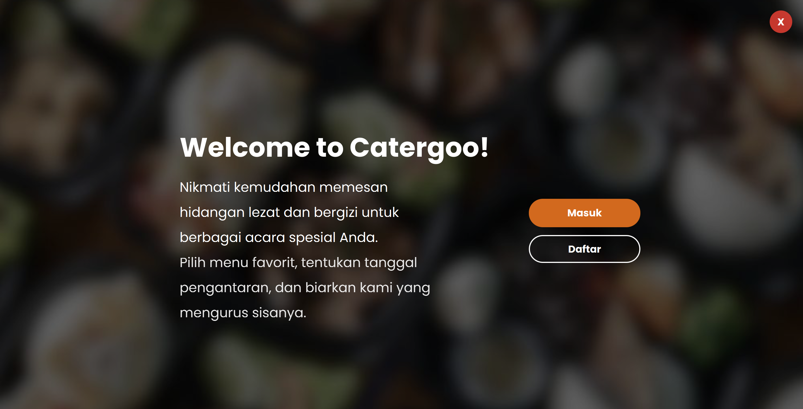
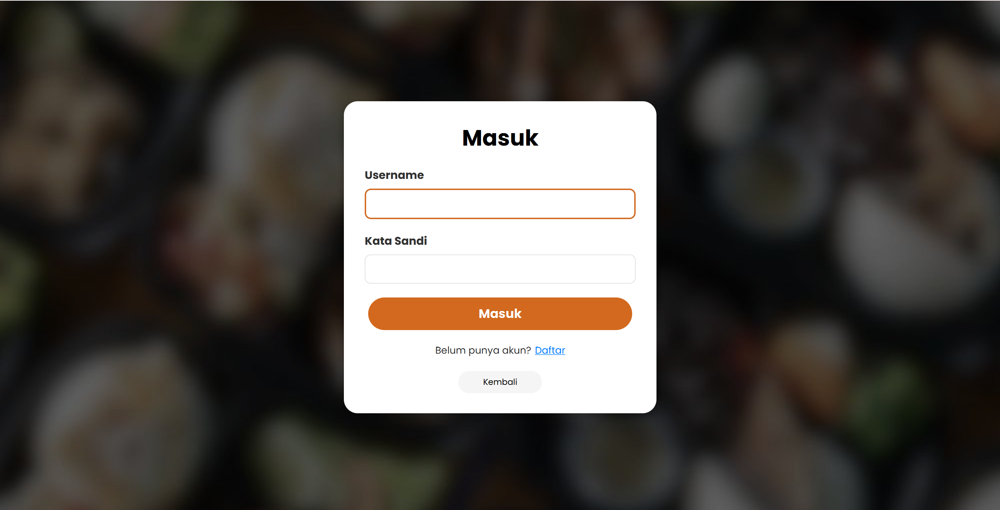
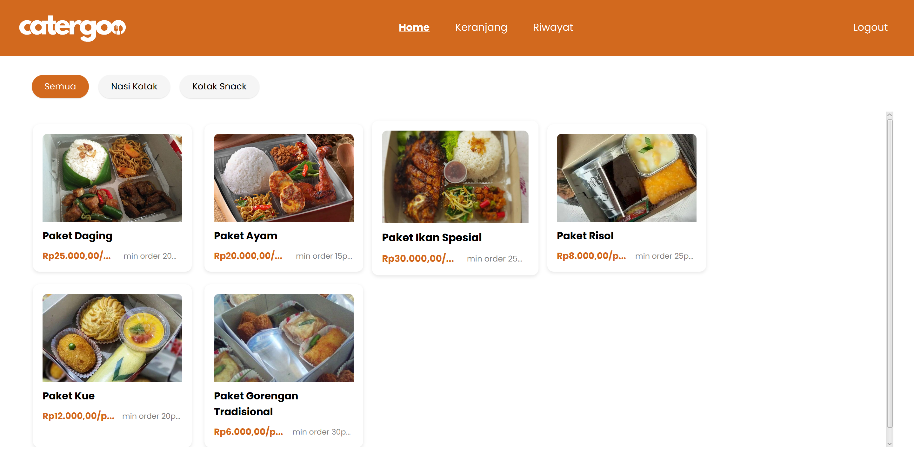
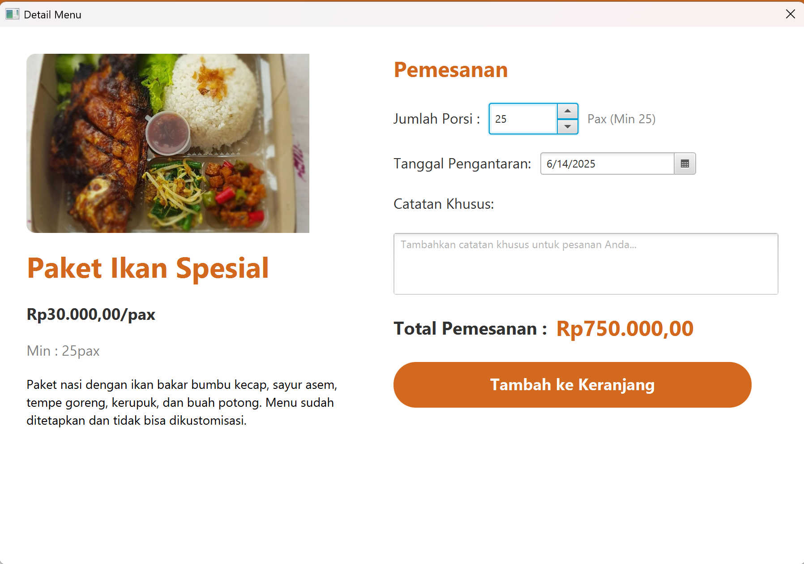
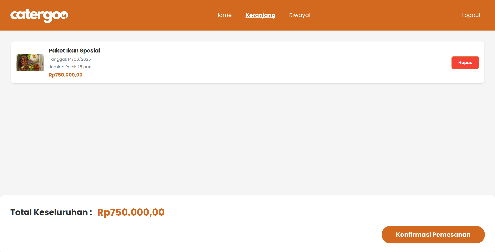
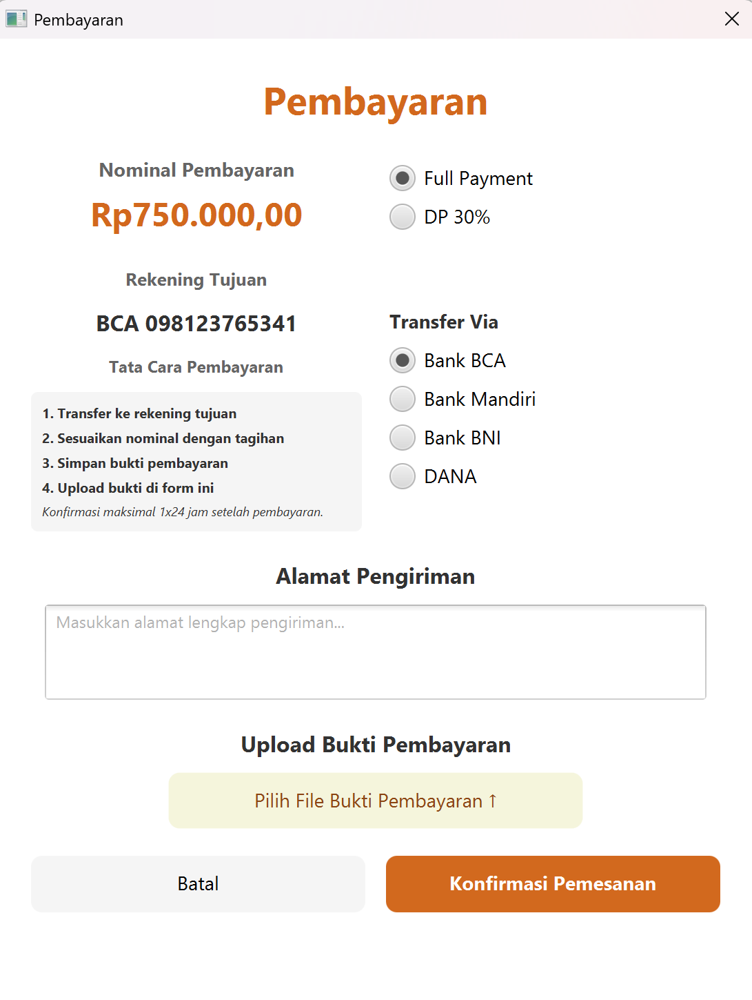
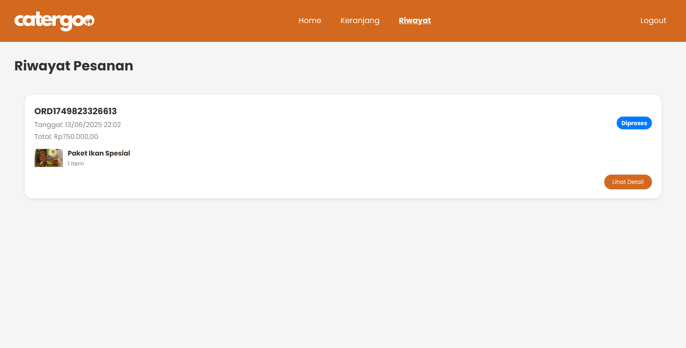

# 🍽️ Aplikasi Catergoo

**Catergoo** adalah aplikasi desktop untuk sistem pemesanan catering yang dibangun menggunakan JavaFX. Aplikasi ini memungkinkan pengguna untuk memesan berbagai paket makanan dan snack dengan fitur kustomisasi, manajemen keranjang belanja, dan tracking pesanan.


## 🚀 Cara Menjalankan Aplikasi

### 📋 Prasyarat

- **Java Development Kit (JDK)** ☕: Versi 11 atau lebih tinggi
- **Gradle** 🔧: Versi yang kompatibel dengan proyek (dikonfigurasi di `gradle-wrapper.properties`)
- **JavaFX SDK** 🎨: Versi 17.0.2 (ditentukan di `build.gradle`)

### ⚙️ Langkah Penyiapan

1. **Kloning Repositori** 📥:

   ```bash
   git clone https://github.com/chxnsa/Catergoo.git
   cd catergoo
   ```

2. **Instalasi Dependensi** 📦:
   Pastikan Gradle terinstal, lalu jalankan:

   ```bash
   gradle build
   ```

   Perintah ini akan mengunduh semua dependensi, termasuk JavaFX dan pustaka pengujian.

3. **Jalankan Aplikasi** ▶️:
   Gunakan Gradle untuk menjalankan aplikasi:

   ```bash
   ./gradlew run
   ```

   Alternatifnya, setelah build, jalankan kelas utama secara langsung:

   ```bash
   java --module-path /path/to/javafx-sdk-17.0.2/lib --add-modules javafx.controls,javafx.fxml -cp build/libs/catergoo-1.0.0.jar com.catergoo.CatergooApplication
   ```

4. **Jalankan Pengujian** 🧪:
   Eksekusi unit test dengan:
   ```bash
   gradle test
   ```
   Pengujian menggunakan JUnit 5, Mockito, dan TestFX untuk pengujian UI.

### 📝 Catatan Penyiapan Proyek

- Proyek menggunakan Gradle sebagai alat build, dengan konfigurasi di `build.gradle` dan `settings.gradle`.
- Modul JavaFX disertakan melalui plugin `org.openjfx.javafxplugin`.
- Pastikan path JavaFX SDK diatur dengan benar jika menjalankan secara manual.

## 📖 Panduan Penggunaan Aplikasi Catergoo

Aplikasi Catergoo memudahkan Anda memesan katering untuk berbagai acara. Berikut adalah panduan langkah demi langkah untuk menggunakan aplikasi ini:

### 1. 🏠 Memulai Aplikasi



1. **Buka Aplikasi**:
   - Jalankan aplikasi Catergoo. Anda akan disambut dengan halaman **Welcome** (Selamat Datang).
   - Halaman ini menampilkan pesan: _"Nikmati kemudahan memesan hidangan lezat dan bergizi untuk berbagai acara spesial Anda."_
2. **Pilih Opsi**:
   - Klik tombol **Masuk** untuk login jika sudah memiliki akun.
   - Klik tombol **Daftar** untuk membuat akun baru.

### 2. 📝 Registrasi Akun


1. **Akses Halaman Daftar**:
   - Dari halaman Welcome, klik **Daftar** untuk menuju halaman registrasi.
2. **Isi Formulir**:
   - Masukkan **Username** (minimal 5 karakter).
   - Masukkan **Kata Sandi** (minimal 8 karakter, dengan minimal 3 angka).
   - Pastikan input memenuhi validasi yang ditampilkan.
3. **Submit Registrasi**:
   - Klik tombol **Daftar** untuk membuat akun.
   - Jika sudah memiliki akun, klik tautan **Sudah punya akun? Masuk** untuk kembali ke halaman login.
4. **Hasil**:
   - Jika berhasil, Anda akan diarahkan ke halaman login.

### 3. 🔐 Login ke Aplikasi



1. **Akses Halaman Masuk**:
   - Dari halaman Welcome, klik **Masuk**.
2. **Isi Formulir**:
   - Masukkan **Username** dan **Kata Sandi** yang telah didaftarkan.
3. **Submit Login**:
   - Klik tombol **Masuk** untuk masuk ke aplikasi.
   - Jika belum memiliki akun, klik tautan **Belum punya akun? Daftar** untuk menuju halaman registrasi.
4. **Hasil**:
   - Jika login berhasil, Anda akan masuk ke halaman **Home** aplikasi utama.

### 4. 🏪 Memilih Menu (Home)



1. **Akses Halaman Home**:
   - Setelah login, Anda akan berada di halaman **Home**, yang menampilkan daftar menu seperti **Paket Daging** 🥩, **Paket Ayam Bakar** 🍗, **Paket Ayam Goreng** 🍖, dan **Paket Mix** 🍱.
2. **Filter Kategori**:
   - Gunakan filter di bagian atas (**Semua**, **Nasi Kotak**, **Kotak Snack**, **Paket**) untuk mempersempit pilihan menu.
3. **Pilih Item**:
   - Klik salah satu item menu (misalnya, **Paket Daging**) untuk membuka halaman **Item Detail/Customization**.

### 5. ✏️ Mengkustomisasi dan Memesan Item



1. **Akses Halaman Kustomisasi**:
   - Setelah memilih item (misalnya, **Paket Daging**), Anda akan melihat detail seperti harga (Rp 30.000/pax), minimum order (100 pax), dan deskripsi menu.
2. **Pilih Opsi Kustomisasi** ⚙️:
   - Pilih **Sayur** (misalnya, Capcay) dari dropdown.
   - Pilih **Lauk Tambahan** (misalnya, Tempe Oreg).
   - Pilih **Buah** (misalnya, Pisang).
   - Tentukan apakah ingin **Kerupuk** (pilih **Ya** atau **Tidak**).
3. **Atur Pemesanan** 📅:
   - Masukkan **Jumlah Porsi** (minimal sesuai minimum order, misalnya 100 pax).
   - Pilih **Tanggal Pengantaran** menggunakan DatePicker (misalnya, 19/06/2025). Tanggal akan divalidasi berdasarkan ketersediaan dan jumlah pesanan (H-1 untuk ≤50 pax, H-2 untuk >50 pax).
   - Tambahkan **Catatan Khusus** jika ada (opsional).
4. **Lihat Total** 💰:
   - Total pemesanan (misalnya, Rp 3.000.000 untuk 100 pax Paket Daging) akan ditampilkan secara dinamis.
5. **Tambah ke Keranjang**:
   - Klik tombol **Tambah ke Keranjang** untuk menyimpan pesanan ke keranjang. 

### 6. 🛒 Mengelola Keranjang (Cart)



1. **Akses Halaman Keranjang**:
   - Klik tab **Keranjang** di navigasi atas.
2. **Lihat Isi Keranjang**:
   - Keranjang akan menampilkan item seperti:
     - **Paket Daging** 🥩: 100 pax, tanggal 19 Juni 2025, kustomisasi (Capcay, Tempe Oreg, Kerupuk, Pisang), subtotal Rp 3.000.000.
     - **Paket Risol** 🥟: 100 pax, tanggal 19 Juni 2025, kustomisasi (Bolu Coklat, Buras Ayam), subtotal Rp 900.000.
   - Total keseluruhan (misalnya, Rp 3.900.000) ditampilkan di bawah.
3. **Hapus Item** ✏🗑️:
   - Klik **Hapus** untuk menghapus item.
4. **Masukkan Alamat** 📍:
   - Isi kolom **Alamat Pengiriman** untuk pengantaran.
5. **Konfirmasi Pemesanan**:
   - Klik tombol **Konfirmasi Pemesanan** untuk menuju halaman pembayaran.

### 7. 💳 Melakukan Pembayaran



1. **Akses Halaman Pembayaran**:
   - Setelah konfirmasi dari keranjang, Anda akan diarahkan ke halaman **Pembayaran**.
2. **Pilih Opsi Pembayaran** 💰:
   - Pilih **Full Payment** atau **DP 30%**.
   - Nominal pembayaran (misalnya, Rp 3.900.000 untuk full payment) akan ditampilkan.
3. **Pilih Rekening Tujuan** 🏦:
   - Pilih bank untuk transfer (misalnya, **BCA 098123765341**).
   - Nomor rekening akan ditampilkan sesuai pilihan bank.
4. **Lakukan Transfer**:
   - Transfer sesuai nominal yang ditampilkan dan simpan bukti transaksi.
5. **Unggah Bukti Pembayaran** 📸:
   - Klik **Upload Bukti Pembayaran** untuk mengunggah screenshot bukti transfer.
6. **Konfirmasi**:
   - Klik tombol **Konfirmasi Pembayaran** untuk menyelesaikan proses.
   - Pesanan akan ditambahkan ke riwayat, dan keranjang akan dikosongkan.
   - Tunggu konfirmasi dari sistem (maksimal 24 jam).

### 8. 📜 Melihat Riwayat Pesanan



1. **Akses Halaman Riwayat**:
   - Klik tab **Riwayat** di navigasi atas.
2. **Lihat Pesanan**:
   - Halaman ini menampilkan pesanan sebelumnya, misalnya:
     - **Paket Daging** 🥩: 100 pax, tanggal 19 Juni 2025, subtotal Rp 3.000.000, status **Menunggu Konfirmasi** ⏳.
     - **Paket Risol** 🥟: 100 pax, tanggal 19 Juni 2025, subtotal Rp 900.000, status **Menunggu Konfirmasi** ⏳.
3. **Detail Pesanan**:
   - Klik **Lihat Detail** untuk melihat kustomisasi dan informasi lengkap pesanan.
4. **Pembaruan Status** 🔄:
   - Status pesanan akan diperbarui secara otomatis oleh sistem (misalnya, dari "Menunggu Konfirmasi" ke "Diproses" atau "Selesai").

### 9. 🚪 Logout

1. **Keluar dari Aplikasi**:
   - Klik tombol **Logout** di navigasi atas.
2. **Hasil**:
   - Anda akan kembali ke halaman **Welcome**.
   - Sesi pengguna akan diakhiri, dan Anda perlu login kembali untuk mengakses aplikasi.

## ⚠️ Catatan Penting

- **Validasi Tanggal** 📅: Pastikan tanggal pengantaran yang dipilih tersedia dan sesuai dengan jumlah pesanan (H-1 atau H-2).
- **Kustomisasi** ⚙️: Item seperti **Paket Daging** memungkinkan kustomisasi sayur, lauk, buah, dan kerupuk; pastikan semua opsi dipilih sebelum menambah ke keranjang.
- **Pembayaran** 💳: Simpan bukti transfer untuk memudahkan konfirmasi. Unggah bukti dalam format gambar yang jelas.
- **Riwayat** 📜: Gunakan halaman Riwayat untuk memantau status pesanan Anda.

Dengan mengikuti panduan ini, Anda dapat dengan mudah memesan katering melalui aplikasi Catergoo! 🎉

## 🏗️ Struktur Kode

Proyek ini memiliki struktur modular di bawah direktori `src/main/java/com/catergoo`, yang diorganisasi ke dalam paket untuk pemisahan tanggung jawab yang jelas:

```
src/catergoo/
├── CatergooApp.java          # Main class
├── manager/                          # Business Logic Layer
│   ├── MenuManager.java             # Menu data management
│   └── SessionManager.java          # User session management
├── model/                           # Data Models
│   ├── MenuItem.java                # Abstract base class
│   ├── FoodPackage.java             # Food menu items
│   ├── SnackPackage.java            # Snack menu items
│   ├── CartItem.java                # Shopping cart items
│   ├── Order.java                   # Order data
│   ├── User.java                    # User data
│   └── Customizable.java            # Interface for customizable items
├── service/                         # Background Services
│   └── NotificationService.java     # Order status updates
├── util/                            # Utility Classes
│   ├── UIUtil.java                  # UI components factory
│   ├── DateUtil.java                # Date utilities
│   ├── ValidationUtil.java          # Input validation
│   └── FontManager.java             # Font management
└── view/                            # UI Layer
    ├── SceneManager.java            # Scene navigation
    ├── WelcomeView.java             # Welcome screen
    ├── LoginView.java               # Login form
    ├── RegisterView.java            # Registration form
    ├── HomeView.java                # Main menu screen
    ├── ItemDetailView.java          # Item detail modal
    ├── CartView.java                # Shopping cart
    ├── PaymentView.java             # Payment form
    ├── HistoryView.java             # Order history
    └── component/                   # Reusable Components
        ├── NavigationBar.java       # Top navigation
        ├── MenuItemCard.java        # Menu item display
        ├── CartItemRow.java         # Cart item display
        └── CustomizationPanel.java  # Customization UI
```

## 🏛️ Penerapan Pilar OOP

Aplikasi Catergoo menerapkan empat pilar Object-Oriented Programming dengan implementasi yang komprehensif:

| Pilar OOP | Implementasi | Contoh Kode |
|-----------|-------------|-------------|
| **🔒 Encapsulation** | Semua atribut kelas bersifat private dengan akses melalui getter dan setter publik | Di `MenuItem.java`, atribut seperti `itemName`, `pricePerPax` bersifat private, diakses melalui metode seperti `getItemName()` dan `isDateAvailable()` |
| **🧬 Inheritance** | Kelas turunan mewarisi properti dan method dari kelas induk | `FoodPackage.java` dan `SnackPackage.java` mewarisi kelas abstrak `MenuItem.java`, mewarisi atribut dan metode umum seperti `displayInfo()` |
| **🎭 Abstraction** | Penggunaan kelas abstrak dan interface untuk menyembunyikan detail implementasi | Kelas abstrak `MenuItem` mendefinisikan metode `displayInfo()` yang diterapkan di subkelas. Interface `Customizable` menetapkan kontrak untuk item yang dapat dikustomisasi |
| **🎪 Polymorphism** | Kemampuan objek untuk mengambil banyak bentuk melalui method overriding dan overloading | **Method Overriding**: Subkelas mengoverride `displayInfo()` dan `getMinBookingDate()` untuk logik spesifik<br>**Method Overloading**: Konstruktor `MenuItem` dengan parameter berbeda<br>**Interface Polymorphism**: `FoodPackage` dan `SnackPackage` mengimplementasikan `Customizable` |

## 🔧 Catatan Tambahan

- **Implementasi Thread** 🧵: Kelas `NotificationService` menggunakan thread latar belakang untuk memeriksa dan memperbarui status pesanan secara berkala, menjaga responsivitas UI dengan `Platform.runLater()` untuk pembaruan UI.
- **Manajemen Sesi** 👥: `SessionManager` mengisolasi data pengguna, memastikan setiap pengguna memiliki keranjang dan riwayat pesanan sendiri.


---

## 👥 Tim Pengembang

• [ANDI KHAERUNNISA ODDANG](https://github.com/chxnsa) ( H071241068 )

• [AKMAL](https://github.com/Onlyadmirer) ( H071241065 )

• [SARHAM SAN](https://github.com/llLanisterll) ( H071241059 )

---

**📧 Kontak:** Untuk detail lebih lanjut, Anda dapat menghubungi developer melalui email yang tersedia di repository.

**🙏 Terima kasih atas perhatian Anda!** ✨

---
